# Getting started

To quickly start with Open Integration Engine™️, also called OIE™️ in this documentation, 
you can use the different installers available on Windows, macOS, and Linux platforms.

::: info

All installers are available at the releases page on GitHub, see [GitHub Releases](https://github.com/OpenIntegrationEngine/engine/releases)

The installers are available in 2 flavors:

* With Java Runtime Environment (JRE) 
* Without JRE
:::

## System requirements

The OIE Server operates as a completely self-contained application and does not depend on any external application server.

### Java requirements

The Open Integration Engine requires Java 17+ to work.

### Database requirements

OIE uses an embedded Apache Derby database by default, which allows you to store configuration and messages, for the purpose of rapid deployment, development and testing.

For production deployments, it is recommended to use only database versions currently receiving official security and maintenance support from their respective vendors. The following database engines are supported as backends:

* PostgreSQL
* MySQL
* MariaDB
* Oracle
* SQL Server

## Download and installation

You can download the latest version of Open Integration Engine for your platform at this 
[address](https://github.com/OpenIntegrationEngine/engine/releases/latest).

### Windows

::: info
Add Screenshots for windows Installation

Wizard screenshots are similar to macOS part
:::

### macOS

Locate the downloaded .dmg file and double-click the file to mount it.

A window will open showing the Open Integration Engine Installer. Double-click to launch the Installer Wizard.

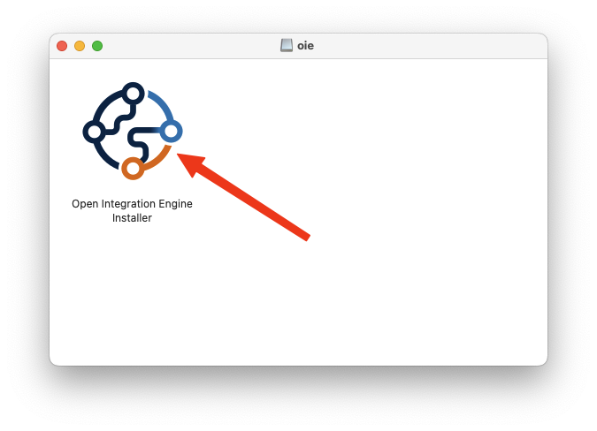

Click `Next` on the initial Setup screen to move to the License Screen.
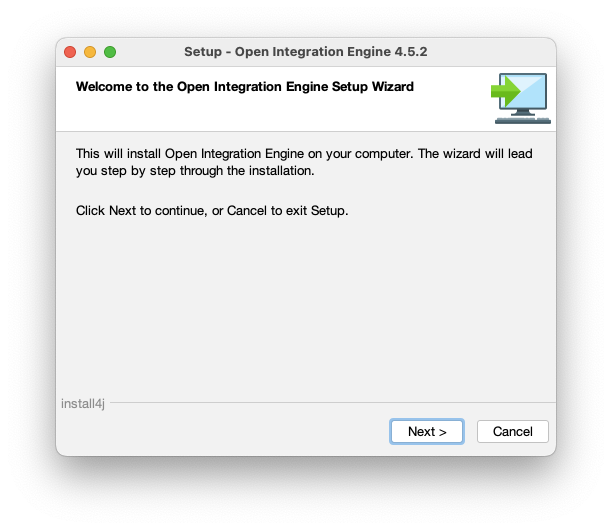

To continue you must accept this license by selecting `I accept the agreement` and then click on `Next`.

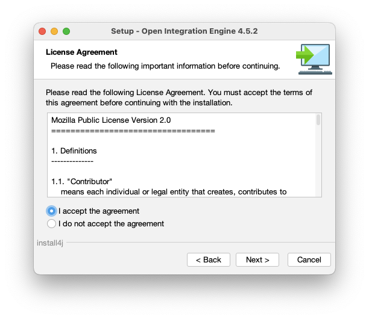

The next screen presents information about the current release. Click on `Next` to continue.

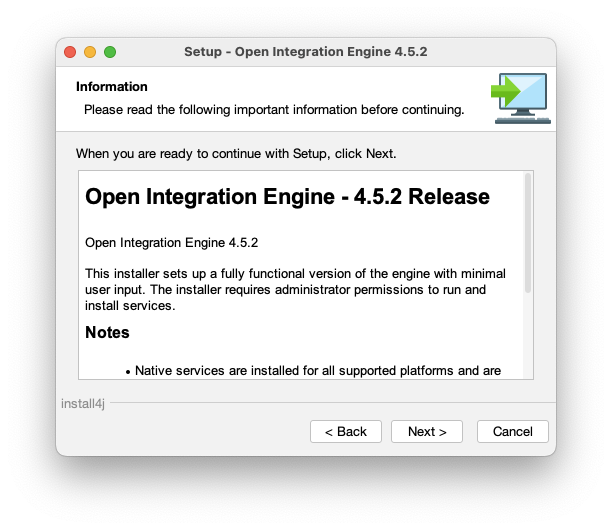

Choose a destination directory for the installation and click `Next` to start the installation. You can choose another folder if you do not want to install as a global package.

::: warning
If you use the default application folder, you will need to use the `sudo` command to launch the OIE server.
:::

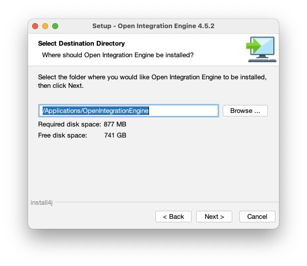

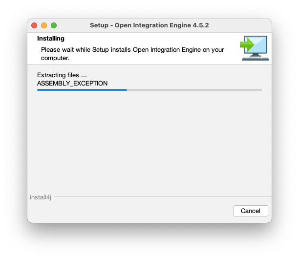

The last screen informs you that installation is complete. Click `Finish` to close the installer.

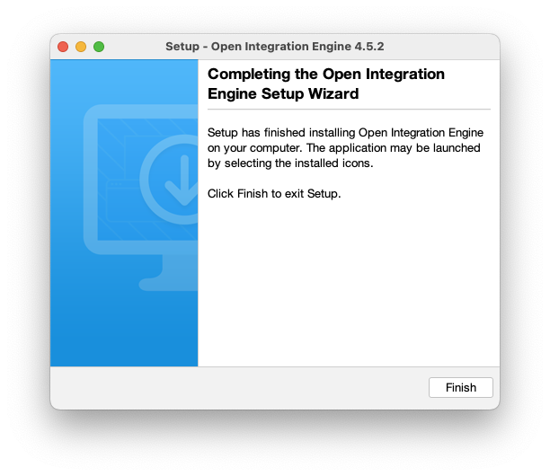

Now, open a Terminal and start the OIE server

```shell
sudo /Applications/OpenIntegrationEngine/oieserver
```

During the first launch, the server initializes the database. If the server is launched correctly, you should see the following lines:

```log
INFO  2026-01-15 20:07:38.773 [Main Server Thread] com.mirth.connect.server.Mirth: Open Integration Engine 4.5.2 (Built on July 8, 2025) server successfully started.
INFO  2026-01-15 20:07:38.776 [Main Server Thread] com.mirth.connect.server.Mirth: This product was developed by NextGen Healthcare (https://www.nextgen.com) and its contributors (c)2005-2024.
INFO  2026-01-15 20:07:38.776 [Main Server Thread] com.mirth.connect.server.Mirth: Open Integration Engine contributors (c)2025.
INFO  2026-01-15 20:07:38.777 [Main Server Thread] com.mirth.connect.server.Mirth: Running OpenJDK 64-Bit Server VM 17.0.15 on Mac OS X (15.7.3, aarch64), derby, with charset UTF-8.
INFO  2026-01-15 20:07:38.778 [Main Server Thread] com.mirth.connect.server.Mirth: Web server running at http://192.168.1.X:8080/ and https://192.168.1.X:8443/
```

::: tip
Please note these URLs, as we will need them later.
:::

## First launch

To verify if the OIE server is available, open your web browser and enter the URL previously noted.

After accepting the self-signed certificate in your browser, you will see this page:

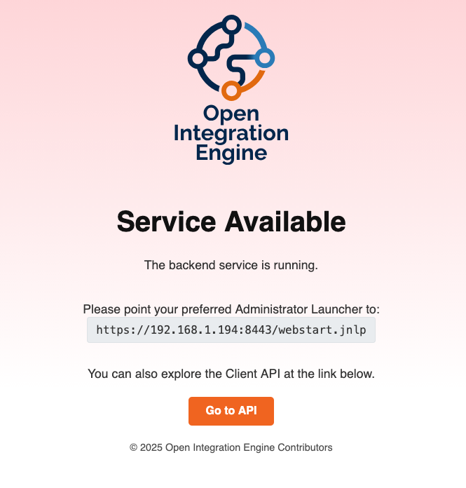

Copy the Administrator Launcher URL.

### Ballista

[Ballista](https://github.com/kayyagari/ballista/releases) is an open-source Administrator launcher for Open Integration Engine built on Tauri.

### MCAL

The original Mirth® Connect Administrator Launcher by NextGen Healthcare (MCAL) works with OIE. Here is how you can use it to launch the OIE Administrator client GUI application.

Go to the macOS Launcher and search Mirth, you will see this icon.

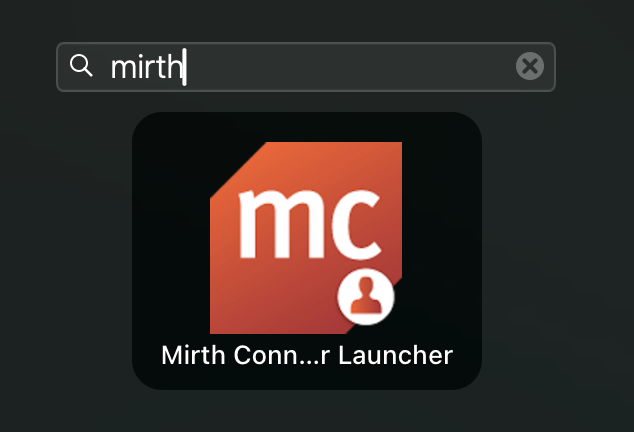

If it's the first launch, the left panel with connections is empty.

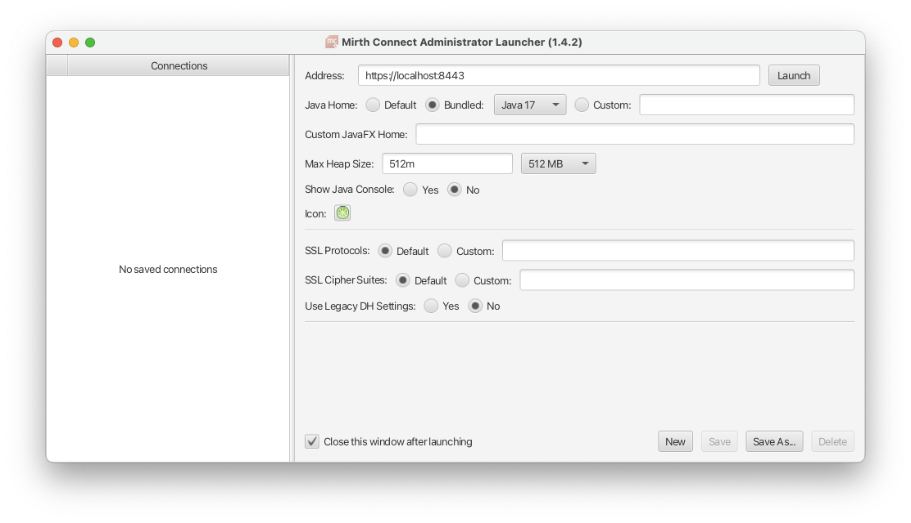

To work better with OIE, choose `Bundled Java 17`

And just click on `Launch` at the top right screen.

You should see a progress bar that will load the files necessary to launch the Open Integration Engine client.

## Logging in

::: info
If you use a new instance, the default credentials are:

* login: **admin**
* password: **admin**
:::

Enter your credentials and click `Login` when the login screen appears.

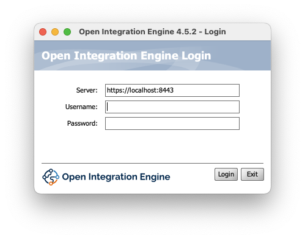

Upon successful login, a brief loading screen will display.

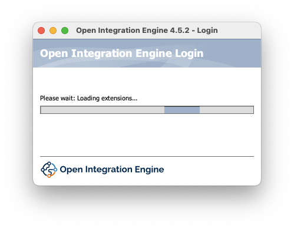

After some time, you will see the OIE dashboard.

Now it asks to change the default password if this is your first time logging in.

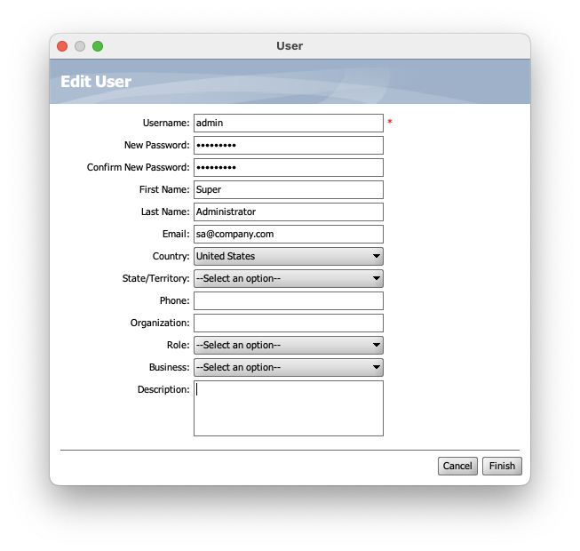

Fill the information, and don't forget to set the `New Password` (2 times)

And click on `Finish`

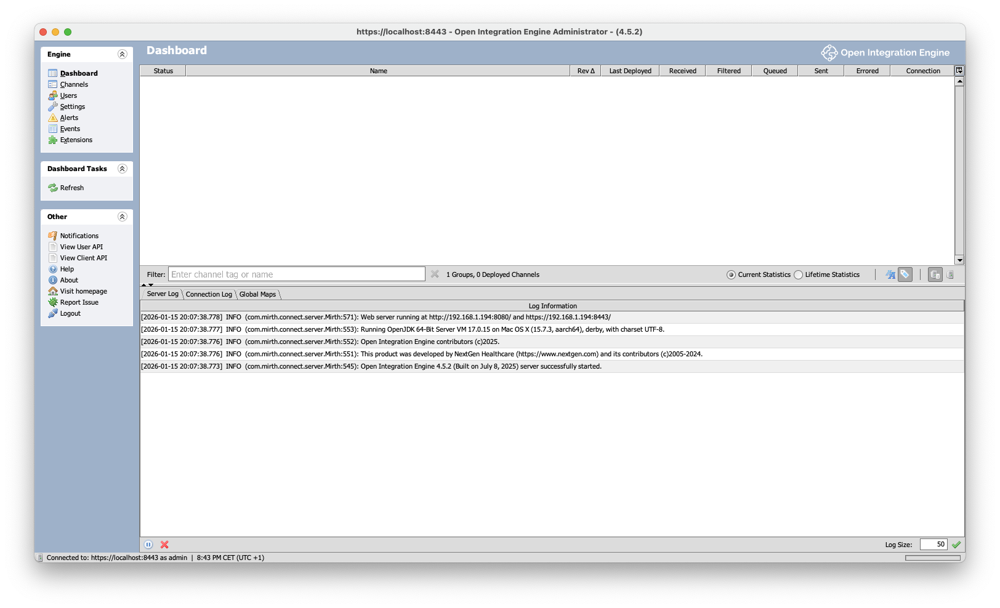

It's finished. Now you can start to use your OIE server.
